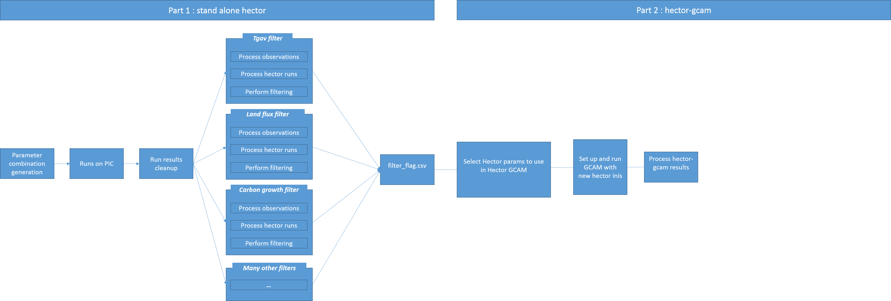

# hector-SA-npar

### About 

Hector sensitivity analysis for n combined parameter sets, the objective of this project is to investiage the uncertainty of Carbon-cycle paramters. 
This read me provides a general overview of the project code, for more deatils about the projects please refer to the wiki. 

The project code is broken up into three parts. 
* `code/part_1`: standalone hector is run x times using the quasi random combinations of n C parameters. After cleaning up the hector 
results the hector runs are filtered by observational data. 
* `code/part_2`: parameter sets used in standalone Hector runs that pass through the observational filtering process are then used in hector - GCAM
* `code/visualize`: contains the code to visualize and graph results.

